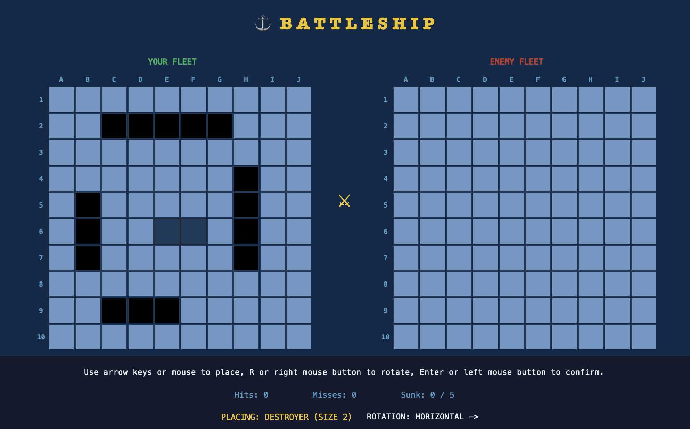
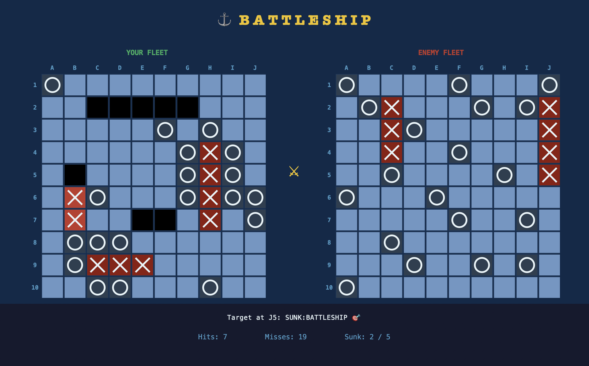
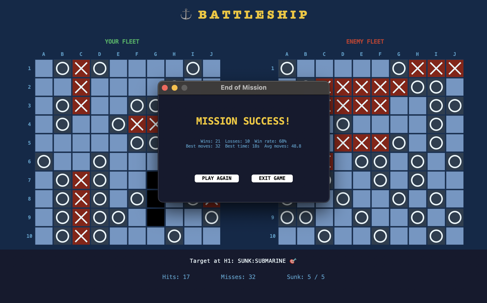
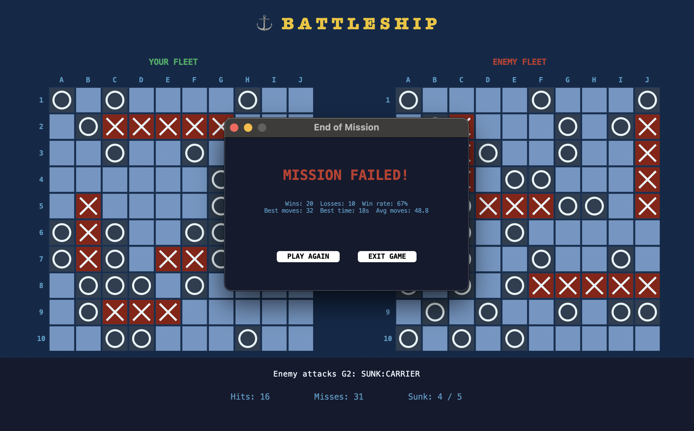

# Battleship ⚓

A Battleship game built in Python — you versus a smart AI that hunts, tracks, and sinks your fleet. Ships are placed manually with a live preview, stats are tracked across sessions, and the whole thing runs on Mac and Windows.

---

## 1. Introduction

### What is it?

Classic 10×10 Battleship. You place your 5 ships, then take turns firing at the enemy grid. The AI fires back — and it's not random. Hit a ship and both you and the AI get an extra turn. First to sink all 5 enemy ships wins.

### Running the game

```
git clone https://github.com/mikutisaurimas-glitch/Battleship.git
cd Battleship
python Main.py
```

> Requires Python 3.10+. If `python` doesn't work, try `python3`.

### Controls

**Ship placement:**

| Action | Control |
|---|---|
| Move ship | Arrow keys or mouse |
| Rotate | R key or right-click |
| Place | Enter or left-click |

**In game:**

| Action | Control |
|---|---|
| Fire | Left-click on enemy grid |

---

## 2. Body / Analysis

### OOP Pillars

#### Encapsulation

Each class controls access to its own data. `Board` owns its `grid` and `ships` internally — nothing outside reads or writes them directly. The only way in is through `place_ship`, `attack`, and `all_sunk`.

```python
class Board:
    def __init__(self, size=10):
        self.size = size
        self.grid = [[None for _ in range(size)] for _ in range(size)]
        self.ships = []

    def attack(self, x, y): ...
    def all_sunk(self): ...
```

#### Abstraction

`Ship` hides how hits are counted. Callers never touch `ship.hits` — they just ask `ship.is_sunk()` and let the class handle the rest.

```python
class Ship:
    def hit(self):
        if not self.is_sunk():
            self.hits += 1

    def is_sunk(self):
        return self.hits >= self.size
```

#### Inheritance

`AIPlayer` extends `Player` — it gets the board and `attack()` for free and builds its own targeting logic on top. No code is duplicated between the two.

```python
class AIPlayer(Player):
    def make_move(self, opponent_board):
        self._sync_alive(opponent_board)
        x, y = self._pick_target()
        result = self.attack(opponent_board, x, y)
        ...
```

#### Polymorphism

`Player` and `AIPlayer` both expose the same `attack(opponent_board, x, y)` method. `Game` calls it the same way for both — it doesn't need to know which type it's dealing with.

```python
result = self.player.attack(self.ai.board, x, y)
result = self.attack(opponent_board, x, y)
```

---

### Design Pattern: Factory Method

`ShipFactory` is the single place where the fleet is defined. Nothing else constructs ships directly — not `Game`, not the GUI, not the tests. Change the fleet once in `ShipFactory` and it updates everywhere.

```python
class ShipFactory:
    @staticmethod
    def create_fleet():
        return [
            Ship("Carrier",    5),
            Ship("Battleship", 4),
            Ship("Cruiser",    3),
            Ship("Submarine",  3),
            Ship("Destroyer",  2),
        ]
```

Factory was chosen over Singleton (the game can have multiple independent instances) and over Builder (the ships have simple, fixed constructors that don't need step-by-step assembly).

---

### Composition and Aggregation

`Game` uses **composition** — it creates and owns `Player` and `AIPlayer` directly. They live and die with the game instance.

`BattleshipGUI` uses **aggregation** — it holds a reference to a `Game` object but only talks to it through public methods. The GUI doesn't control what happens inside `Game`.

```python
class Game:
    def __init__(self, player_name="Player"):
        self.player = Player(player_name)
        self.ai = AIPlayer()
```

---

### AI Strategy

The AI runs a two-phase approach:

**Hunt** — no active hits, so it picks a random cell. But it filters out any cell where the smallest remaining ship physically can't fit. This cuts wasted shots significantly late in the game.

**Target** — a hit is on the board. The AI first tries to extend any line of consecutive hits, then falls back to probing adjacent cells. Once a ship sinks, those cells are cleared and it returns to hunt mode.

```python
def _pick_target(self):
    if not self.hit_targets:
        return self._hunt_move()

    for hx, hy in self.hit_targets:
        for dx, dy in [(1, 0), (0, 1)]:
            if (hx + dx, hy + dy) in hit_set:
                ...

    for hx, hy in self.hit_targets:
        for ddx, ddy in [(-1,0),(1,0),(0,-1),(0,1)]:
            if self._valid(nx, ny):
                return (nx, ny)
```

---

### File Reading and Writing

Every game result is written to `stats.json` — wins, losses, move counts, and best time. The `Stats` module handles loading and saving:

```python
def load():
    if os.path.exists(STATS_FILE):
        with open(STATS_FILE, "r") as f:
            return json.load(f)
    return dict(DEFAULT)

def save(stats):
    with open(STATS_FILE, "w") as f:
        json.dump(stats, f, indent=2)
```

Stats persist between sessions and are shown on the end screen after every game.

---

### Testing

Core logic is tested with `unittest` in `test_battleship.py`. Run with:

```
python -m unittest test_battleship -v
```

Covers ship sinking, board placement (valid and overlapping), and attack responses (hit, miss, already attacked).

---

## 3. Results and Summary

### Results

- The game is fully playable — ship placement, AI opponent, extra turns on hits, win/loss tracking, and session stats all work as intended.
- The AI's parity-filtered hunting and collinear targeting makes it play noticeably smarter than a purely random opponent, while still being beatable.
- Refactoring into a proper multi-class structure (from an early single-file version) made the codebase significantly easier to test and extend.
- A coin toss at game start decides who fires first, adding a small but meaningful element of fairness.
- Cross-platform support (font switching, DPI awareness, non-blocking screen shake) means the same code runs on Mac and Windows.

### Conclusions

What started as a single script grew into a structured OOP project — six classes, a design pattern, persistent stats, and a polished GUI. The end result is a complete, playable Battleship game that demonstrates all four OOP pillars in a real context rather than a toy example.

The AI is the part that evolved the most — from random guessing to a hunt/target system that prunes impossible cells and extends hit lines intelligently.

Future versions could add difficulty settings (a weaker random AI vs a harder constraint-based one), sound effects, a full leaderboard with username login, and a one-click random ship placement option.

---

## Screenshots

### 🚀 Ship Placement



---

### 🎮 Gameplay



---

### 🏆 Winning



---

### 💀 Losing


